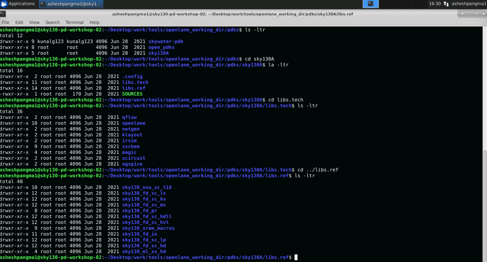
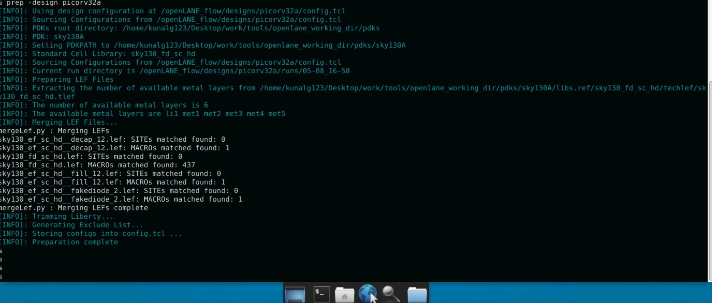

# Advanced-Physica-Design-using-openLANE/Sky130

This repository contains all the steps performed in 5-day Advanced-Physica-Design-using-openLANE/Sky130 workshop. This workshop is focused in complete RTL2GDS flow using openLANE flow which is open source flow.

# Table of Contents

# Day 1 - Exploring Open-source Tools, OpenLANE Flow and Sky130 Pdk

## Open source PDK structure



## Initalizing OpenLANE
In Linux Ubuntu, to invoke OpenLANE, we should first run docker everytime. In our case, we invoke OpenLANE in openlane directory. The script is as follow:
`docker`

There are two modes of operation for OpenLANE: interactive and autonomous.
To invoke openLANE run `./flow.tcl`.
In our workshop, We use interactive mode by running `./flow.tcl -interactive`

After invoking openLANE, we import package required for openLANE of the required version. We use version 0.9.


The next step is to prepare our design for OpenLANE flow. We use *picorv32a* in this workshop. Thus, the following command is:
`prep -design picorv32a`



The technology LEF and cell LEF files are merged  to obtain a merged.lef file during design preparation stage. The LEF files holds various informations of the design such as layer informations, design rules and also information regarding each standard cells necessary for place and route.


## Design synthesis 

We perform RTL synthesis of our prepared design(picorv32a) by using the following command:
```
run_sunthesis
```


The following results are optained.


Chip area = 147792.9184

Number of cells = 14876

Number of flops = 1613

Then, Flop count = Number of cells /over Number of flops = 0.1084 

Buffer count = 1656+8 = 1662

Then, Buffer ratio = Buffer count/ Number of cell = 1662/14876 = 


# Day 2 Floorplan and Introduction to library cell

## Floorplan using OpenLANE


 


The following command is used run Floorplan in OpenLANE:
```
run_floorplan
```


After running floorplan, we obtain picorv32a.floorplan.def file in results/floorplan directory.


### Floorplan Layout in Magic


## Placement

## Placement using OpenLANE


```
run_placement
```


### Placement Layout in Magic


:-------------------------:|:-------------------------:
  |  


# Day 3


# Day 4

# Day 5


