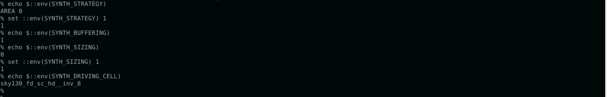
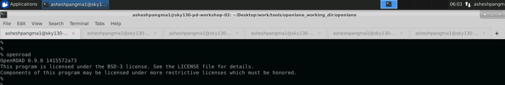
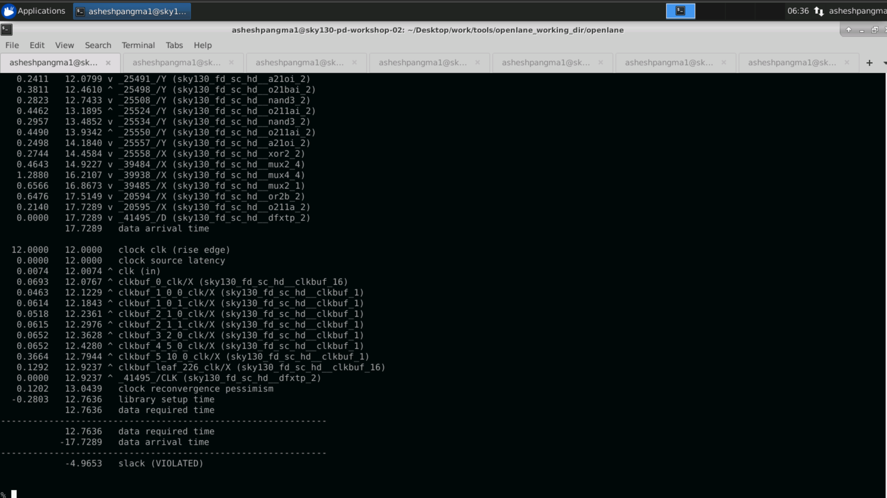

# Advanced-Physical-Design-using-openLANE/Sky130

This repository contains all the steps performed in 5-day Advanced-Physica-Design-using-openLANE/Sky130 workshop. This workshop is focused in complete RTL2GDS flow using openLANE flow which is open source flow. In this workshop, PICORV32A RISC V core design is used.

# Table of Contents

- [Day 1 - Exploring Open-source Tools, OpenLANE Flow and Sky130 Pdk](#day-1---exploring-open-source-tools--openlane-flow-and-sky130-pdk)
  * [Open source PDK structure](#open-source-pdk-structure)
  * [Initalizing OpenLANE](#initalizing-openlane)
  * [Design synthesis](#design-synthesis)
- [Day 2 Floorplan and Introduction to library cell](#day-2-floorplan-and-introduction-to-library-cell)
  * [Floorplan](#floorplan)
  * [Floorplan using OpenLANE](#floorplan-using-openlane)
  * [Floorplan Layout in Magic](#floorplan-layout-in-magic)
  * [Placement](#placement)
  * [Placement using OpenLANE](#placement-using-openlane)
  * [Placement Layout in Magic](#placement-layout-in-magic)
- [Day 3 Library Cell Design in Magic Layout and Ngspice characterization](#day-3-library-cell-design-in-magic-layout-and-ngspice-characterization)
  * [Magic to View CMOS Inverter Layout](#magic-to-view-cmos-inverter-layout)
  * [SPICE netlist extraction from standard cell layout](#spice-netlist-extraction-from-standard-cell-layout)
  * [NGSPICE for Transient Analysis](#ngspice-for-transient-analysis)
- [Day 4 Pre-Layout Timing Analysis and Importance of Good Clock Tree](#day-4-pre-layout-timing-analysis-and-importance-of-good-clock-tree)
  * [Magic Layout to Standard Cell LEF](#magic-layout-to-standard-cell-lef)
  * [OpenSTA for Timing Analysis](#opensta-for-timing-analysis)
  * [TritonCTS for Clock Tree Synthesis](#tritoncts-for-clock-tree-synthesis)
- [Day 5  Final steps for RTL2GDS](#day-5--final-steps-for-rtl2gds)
  * [Generation of Power Distribution network](#generation-of-power-distribution-network)
  * [Generating SPEF file](#generating-spef-file)
- [References](#references)
- [Acknowledgement](#acknowledgement)

# Day 1 - Exploring Open-source Tools, OpenLANE Flow and Sky130 Pdk

## Open source PDK structure


## Initalizing OpenLANE
In Linux Ubuntu, to invoke OpenLANE, we should first run docker everytime. In our case, we invoke OpenLANE in openlane directory. The script is as follow:

`docker`

There are two modes of operation for OpenLANE: interactive and autonomous.
To invoke openLANE run 

`./flow.tcl`.

In our workshop, We use interactive mode by running 

`./flow.tcl -interactive`

After invoking openLANE, we import package required for openLANE of the required version. We use version 0.9.


The next step is to prepare our design for OpenLANE flow. We use *picorv32a* in this workshop. Thus, the following command is:

`prep -design picorv32a`


The technology LEF and cell LEF files are merged  to obtain a merged.lef file during design preparation stage. The LEF files holds various informations of the design such as layer informations, design rules and also information regarding each standard cells necessary for place and route.


## Design synthesis 

We perform RTL synthesis of our prepared design(picorv32a) by using the following command:
```
run_sunthesis
```


The following results are optained.


Chip area = 147792.9184

Number of cells = 14876

Number of flops = 1613

Then, Flop count = Number of cells /over Number of flops = 0.1084 

Buffer count = 1656+8 = 1662

Then, Buffer ratio = Buffer count/ Number of cell = 1662/14876 = 0.1117


# Day 2 Floorplan and Introduction to library cell

## Floorplan

## Floorplan using OpenLANE


 


The following command is used run Floorplan in OpenLANE:
```
run_floorplan
```


After running floorplan, we obtain picorv32a.floorplan.def file in results/floorplan directory.


### Floorplan Layout in Magic


## Placement

## Placement using OpenLANE


```
run_placement
```


### Placement Layout in Magic


`set ::env(FP_IO_MODE) 2`

Placement layout with FP_IO_MODE 2 |  Zoomed in figure
:-------------------------:|:-------------------------:
  |  


# Day 3 Library Cell Design in Magic Layout and Ngspice characterization

At first, we clone the standart inverter cell from repository provided in github to our openlane folder. The command is given below:

`git clone https://github.com/nickson-jose/vsdstdcelldesign.git`


## Magic to View CMOS Inverter Layout

To view the inverter layout in Magic, we first copied the sky130A.tech file to our vsdstdcelldesign directory. Then, the following script is used to view the inverter layout.

`magic -T Sky130A.tech sky130_inv.mg &`


### Extracting SPICE netlist from standard cell layout

`extract all`


`ext2spice cthresh 0 rthresh 0
 ext2spice`
 
 Spice extraction             |  Inverter scale
:----------------------------:|:-------------------------:
  |  
 


`vim sky130_inv.spice`

### NGSPICE for Transient Analysis

`ngspice sky130_inv.spice`

`ngspice 1 -> plot y vs time a`


The waveform shows the inpput and output of inverter w.r.t. time. We can calculate various timing parameters such as rise time delay, fall time delay and propagation delay of the inverter.


The following timing values are obtained from the plot at different values of input and output.


# Day 4 Pre-Layout Timing Analysis and Importance of Good Clock Tree

## Magic Layout to Standard Cell LEF

LEF stands for Library Exchange Format. It holds the information such as input ports, output ports, power and ground rails of cell. We extract LEF file from MAG file of the inverter and plug it into *picorv32a RISC V* core. 

`Tracks.info` provides information about the offset and pitch of a track in given layer both in horizontal and vertical direction. The Track information is given in below mentioned format:

```
<layer-name> <X-or-Y> <track-offset> <track-pitch>
```


Some aspect to remember while generating standard cell LEF are:
 1. The input and the output ports must lie in the intersection of vertical and horizontal tracks.
 2. The width of the standard cell must be in the odd multiple of track horizontal pitch and the height in track vertical pitch.
 3. Appropriate height should be maintained so that the VPWR and VGND fall on the power distribution network.

By using the following command in *tkcon window* we obtain the grid when viewing layout in Magic.

`grid 0.46um 0.34um 0.23um 0.17um`

 Inverter layout with grid    | zoomed in Inverter layout
:----------------------------:|:-------------------------:
            |  

Then, use the following command to create a *sky130_vsdinv.mag* file:

`save sky130_vsdinv.mag`


Now, open magic with the above given *sky130_vsdinv.mag* file and create *LEF* file by using the command below:

`lef write`

This creates a *LEF* file with the same name as the *MAG* file. This is shown by the figure below.


The `conf.tcl` is edited to include typical library, fast library and slow library and the *LEF* file of inverter. These library files are used in STA analysis.


After all these steps, We invoke `docker` and perform synthesis. The steps follows:

`docker`

`./flow.tcl`

`package require openlane 0.9`

`prep -design picorv32a <run-session>`

After preparing our design, we use the following command to ensure that OpenLANE flow takes our *LEF* file.

`set lefs [glob $::env(DESIGN_DIR)/src/*.lef]`

`add_lefs -src $lefs`


Then, we perform synthesis using the following command:

`run_synthesis`

This should put our custom inverter in our *PICORV32a* design. 

 Area Information with sky130_vsdinv instances           |  Cell information
:----------------------------:|:-------------------------:
       |  


We check and set some of the environment variable to improve slack of our design as shown by following diagram.



Then, we perform synthesis again followed by floorplan and placement. In new version of OpenLANE after STA, floorplan could not be performed by command `run_floorplan`. So, we perform the following commands in order:

`init_floorplan`

`place_io`

`global_placement_or`

`detailed_placement`

 Merged.lef File with Inverter            |  Placement with Inverter
:----------------------------:|:-------------------------:
      |  

This figure shows the layout of the design in Magic and we can see our custom inverter in the layout.


## OpenSTA for Timing Analysis

OpenSTA tool is used for Static Timing Analysis(STA) of the design in OpenLANE flow. There are two ways to use this tools.
 1. In OpenLANE flow, use command `openroad` to open OpenROAD where OpenSTA can be invoked.
 2. Outside OpenLANE flow, invoke OpenSTA by using the command below:

`sta <conf-file-if-required>`

We need to configure specific verilog file, constriants, clock period and other necessary parameters. The figure below shows our configuration file:


We can obtain various timing information using OpenSTA tool such as hold time, setup time, total negative slack and worst negative slack. We obtain the following information by invoking OpenSTA using the command specified above. The figure shows negative setup slack which violates our design. We try to improve the slack by replacing nets with higher delays and fanout. 


The figure below shows, net with higher delay is selected and replaced with buffer of larger size. This might improve slack value or make it worse. Replacing cells with larger buffer will increase the cell area.


Here, we see that the slack is improved from -3.68 to -3.1987.


## TritonCTS for Clock Tree Synthesis

TritonCTS is a tool provided for CTS in OpenLANE. CTS is performed to ensure that the clock is distributed evenly to all the sequential elements in a design with minimum clock latency and skew. Some of CTS techniques are H-Tree, X-Tree, Fish bone, etc. CTS is done after floorplan and placement and is performed on a `placement.def` file that is created during placement stage.


The following command is used for Clock Tree Synthesis in OpenLANE:

```
run_cts
```


A file *picorv32a.synthesis_cts.v* is created in the results/synthesis directory








# Day 5  Final steps for RTL2GDS

## Generation of Power Distribution network

In OpenLANE flow, we generate PDN only after we perform Clock Tree Synthesis(CTS). Generally, PDN generation is performed before placement. All the tracks and trails required for routing power to entire chip is generated. The following command is used for generating power distribution network:

```
gen_pdn
```


## TritonRoute for Routing

THe routing process is implemented in two stages.
 1. Global Routing - Routing guides are generated for interconnects
 2. Detailed Routing - Tracks are generated interactively.

TritonRoute 14 ensures that there are no DRC viloations after routing. This is why it takes almost an hour to complete the routing process. We have used TritonRoute "0" for routing process.

```
run_routing
```


If we have any DRC violations after routing, then it should be corrected manyally.


## Generating SPEF file

SPEF stands for Standard Parasitic Exchange Format. It is an IEEE standard for representing parasitic data of wires in a chip design in ASCII format. OpenLANE provides a tool named, SPEF_EXTRACTOR for generating a *SPEF* file. This tool is a *python* based parser. *LEF* and *DEF* files are provided as input to generate a *SPEF* file.
To invoke SPEF_EXTRACTOR, first move to the directory containing SPEF_EXTRACTOR tool and use the command:

`python3 main.py -l <path-to-LEF-file> -d <path-to-DEF-file-created-after-routing>`


# References

* VLSI System Design: https://www.vlsisystemdesign.com/
* OpenLANE: https://github.com/The-OpenROAD-Project/OpenLane

# Acknowledgement

* Kunal Ghosh, Co-founder, VSD Corp. Pvt. Ltd.
* Nickson Jose, Instructor.
* Mukesh Nadar, Platform engineer.


